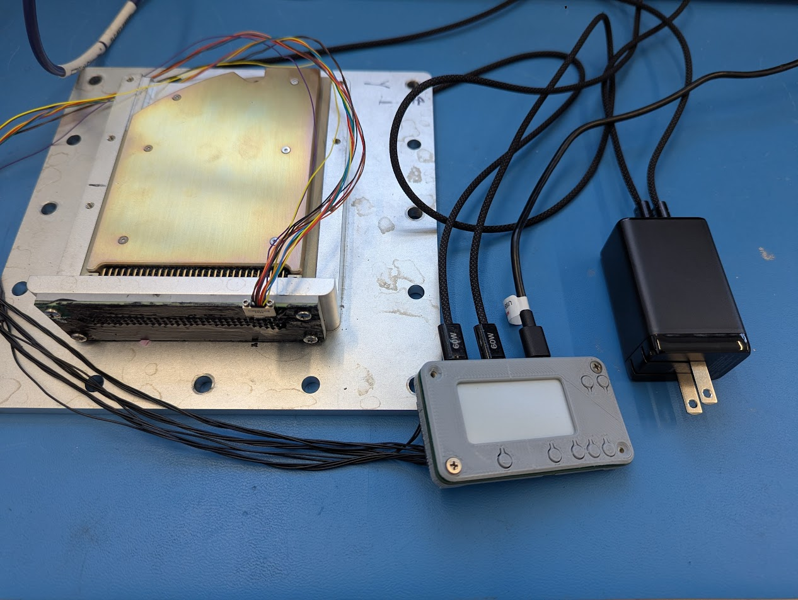

DRC ATP Test Setup Guide

## Prerequisites

First, install the necessary **Python library** by running the following command in your terminal:

```
pip install logic-weave
```
---

## Hardware Setup

To set up the hardware for the test, follow these steps in order:

1. Using the grey programmer, plug the two black **USB-C cables** into the two ports on the left side. Plug the other ends of these cables into the USB-C power brick and then plug the power brick into an outlet.
2. The **omnetics cable** can be screwed into the backplane board. Then, insert the other end of the cable into the back of the programmer board.
3. The **DRC** gets inserted into the backplane. Ensure the lid of the DRC is facing upwards in the same direction the omnetics cable is coming out, and that it is pushed in all of the way.



---

## Operation

Once all the hardware is connected, you can begin the test:

1. Plug the remaining USB-C cable into your PC.
2. Run the main Python script
3. The test will take roughly 50 seconds to complete, and the logs will be streamed through the console, as well as written to a atp.txt file

## Troubleshooting

1. If the hardware gives an error saying invalid PD request, swap the channel 1 and channel 2 power cables. Each port on the power brick only can supply certain voltages
2. If its saying the device can not be found, the port must be manually entered. update the "PORT" variable to the COM port its connected to in main.py